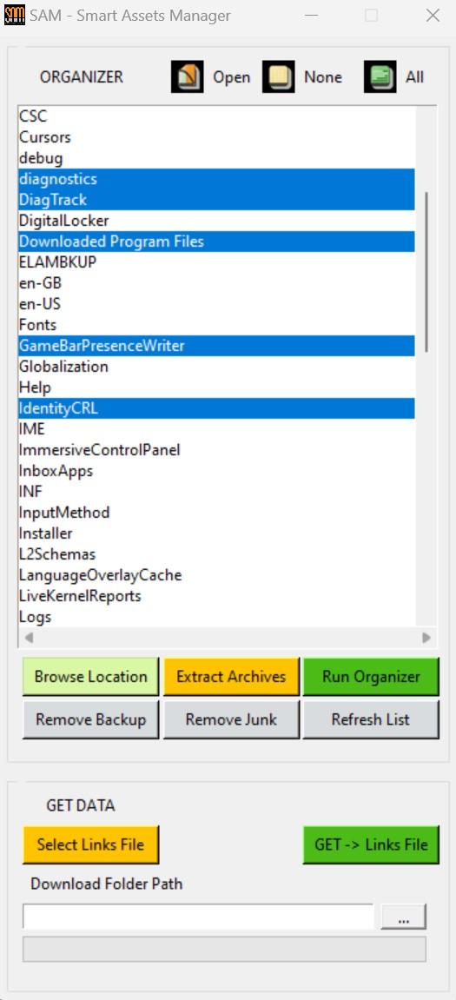

*A.  DESCRIPTION*

The app can be used to automate downloading and organising of multiple assests into individual specific folder structure.

It uses **requests** module to login on hosting platform of the assets and download them from the selected URLs.

*B.  REQUIREMENTS*
* The application is compatible with machines running **WINDOWS 10/11 OS**.
* ***7 Zip*** is required to unpack archive files.
* SAM application can check if ***7 Zip*** is present on the local machine if is opened in ***Administrator mode***. If their presence is not found they will be installed accordingly.

*C.  UTILITIES*
*  You can run **encrypt.py** to create an encrypted version of your ***.env*** file. This will generate an encrypted version of it called ***eenv*** and ***ekey.key*** file which you can use as a the key to access the data inside ***eenv**. 
*  Leave these 2 generated files in the root folder of the app.

*D.  DEPENDENCIES*
* ***7 Zip Installer*** is provided with the SAM installation file.
* SAM installation file will automatically ask for 7 Zip installation on the local machine
* 7 Zip installation files and extra information can be found on the [7ZIP](https://www.7-zip.org/) website

*E.  COMPILERS*
*  In project root folder run __python setup.py build__ --> automatically freezes the app into an executable file using **setup.py** configuration file and **cx_Freeze** library. The command will create the app in the **build** folder
* **INNO SETUP** can be used to create the installation file for the application
 

*F.  MODULES*
* The following modules ***organize_folders.py*** and ***ws_data.py*** are responsible to organize the files in folders and login/download the required assets from the hosting platform.
* ***filters.json*** sets the folders structure and how the different file types will be spread in the root folder

*G.  USING THE APP*  
  * The first section of the app UI focuses on file management where the second one does the web crawling and downloads the data.

  As a best practice is recommended to create a local Virtual Environment. This can be done by:
  * running **pip install virtualenv** to Install a Virtual Environment using Venv
  * To use venv in your project, in your terminal, create a new project folder (**mkdir projectABC**) in the terminal and run **python<version> -m venv <virtual-environment-name>** (**python3.10 -m venv env**)
  * cd in the terminal to the project folder (**cd projectABC**)
  * you will need to activate the virtual env (**source env/bin/activate** for MAC or **source/env/scripts/activate** for Windows)
  * running **pip list** should check if only base packages are present (pip and setup tools) in order for the activation to be correct
  * to install the libraries required run **pip install -r requirements.txt**
  * in case you want to make changes and add use custom libraries you can generate a requirements text file listing all your project dependencies by running **pip freeze > requirements.txt**

**ORGANIZE FOLDERS**
* Organzing multiple folders will require specifying their parent folder path when launching **Browse Location**. The folders that need to be organized must be selected in the **Organise Folders List**. 

!!! **Each folder should include at least an ***archive*** file with the asset and the ***preview*** as an image with 'preview' keyword present in the file name. If ***preview*** tag is not present in the file name then it will be moved to ***MAPS*** folder.**

* **Extract Archives** will unpack each archive found in corresponding folder
* **Run Organizer** will tidy the contents for the folders selected
* Pressing **Clear Junk** and **Clear Backup** buttons will remove these folders content in the parent folders specified.

**GETTING THE DATA**

  You will be required to provide:
* a file saved as ***.txt***  that contains all the URLs in the **Links File**; each ***URL*** should be on a separate line. 
* You will need to specify the Download Folder Path and press **Get ->Links File**.